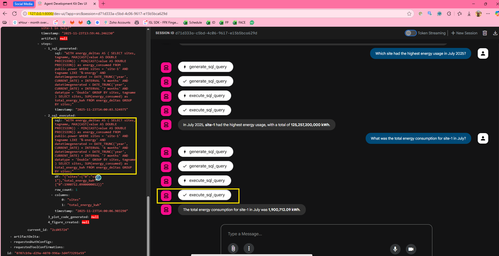
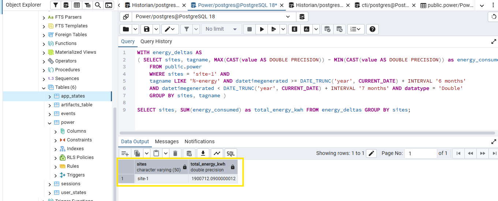
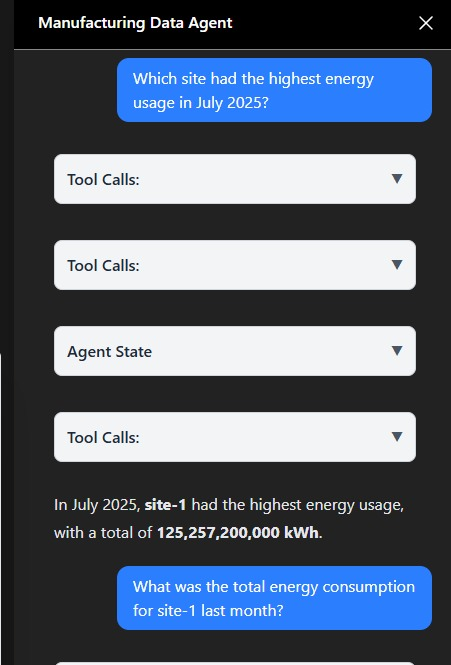
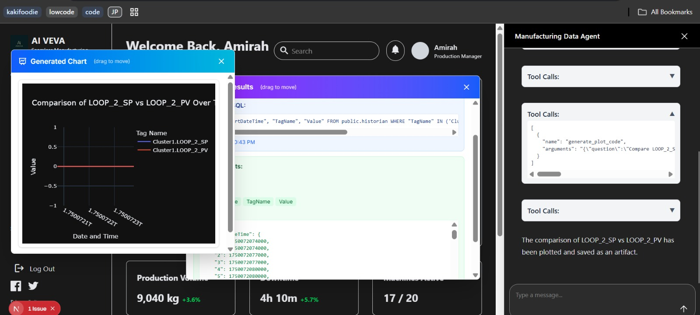

# Vanna Agent (monorepo)

This repository contains two main components for the Vanna / Data Agent project:

- `copilot_backend` — the Python backend (Data Agent, training utilities, and ADK middleware). Go to repo here: https://github.com/hengamirah/copilot_backend
- `copilot_frontend` — the Next.js frontend (copilot UI that connects to the backend). Go to repo here: https://github.com/hengamirah/copilot_frontend

See the component README files for full details and commands:

- Backend: `data_agent/READMe`
- Frontend: `copilot_frontend/README.md`

## Quick start

Use the instructions below as a short path to get both parts running locally.

1) Backend (Data Agent)

   - Change to the backend folder and install dependencies in your Python environment:

     ```powershell
     cd data_agent
     python -m venv .venv
     .\.venv\Scripts\Activate.ps1   # or `conda activate <env>` if using conda
     pip install --upgrade pip
     pip install -r requirements.txt
     ```

   - Create or edit `src/core/.env.development` to provide required environment variables (see `data_agent/READMe` for the list). Minimal examples:

     ```text
     GEMINI_API_KEY=your_gemini_api_key
     COMPLEX_GEMINI_MODEL=gemini-2.5-flash
     CHROMA_PATH=src/agents/sub_agents/vanna_agent/chroma_path
     HOST=localhost
     PORT=5432
     DBNAME=historian
     USER=postgres
     PASSWORD=your_db_password
     ```

   - Start ADK dev server (from the repository root):

     ```powershell
     # from repo root
     adk web --agent data_agent --port 8000
     # or run the FastAPI ADK endpoint directly
     python -m src.backend.ag_ui.main
     ```
    
    *Agent session showing tool calls and state (left panel).*

    
    *Query result shown in pgAdmin — confirms numeric result returned by the agent.*

2) Frontend (Copilot UI)

   - Install Node dependencies and run the dev server:

     ```bash
     cd copilot_frontend
     npm install
     npm run dev
     # or `pnpm dev` / `yarn dev` depending on your package manager
     ```

   - Open `http://localhost:3000` to view the UI. Configure the UI to point to the backend ADK endpoint at `http://localhost:8000/api/agent` if needed.

    

    
    

## Where to look for details

- Backend docs and env/example: `data_agent/READMe` and `data_agent/src/core/.env.development`.
- Frontend docs: `copilot_frontend/README.md` and `copilot_frontend/src/app/page.tsx`.

## Troubleshooting

- If ADK fails to import the agent, ensure you run `adk web` from the repo root (so `data_agent` package is reachable) and that `python-dotenv` is installed in the same environment as `adk`.
- If you encounter database errors on import, either set valid DB env variables or temporarily disable the DB connection in `src/core/dependencies.py` while debugging.

